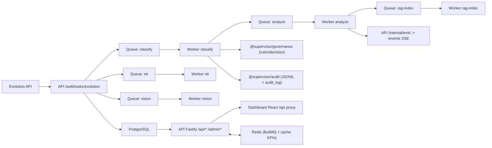

# 01 - Mapa de Arquitetura

## 1) Visão estrutural
Arquitetura em monorepo TypeScript, orientada a eventos:
- ingestão via webhook (API Fastify),
- processamento assíncrono (BullMQ + Redis),
- persistência analítica (PostgreSQL + pgvector),
- consumo operacional (Dashboard React/Vite),
- automações por cron no worker.

## 2) Diagrama lógico (implementação atual)

## 3) Camadas e responsabilidades

### Borda (ingestão e exposição)
- `apps/api/src/index.ts`: bootstrap, plugins (`helmet`, `cors`), migração em startup, registro de rotas.
- `apps/api/src/routes/webhook.ts`: entrada de eventos Evolution, persistência em `raw_events`, criação de mensagens, enqueue de jobs.
- `apps/api/src/routes/*.ts`: APIs de dashboard, conversas, alertas, revisão humana, métricas e SSE.

### Orquestração assíncrona
- `apps/worker/src/index.ts`: workers `classify`, `stt`, `analyze`, `vision`, `rag-index`, `report`.
- Cron jobs no worker:
  - relatório diário,
  - verificação de alertas de governança,
  - rotinas LGPD (anonimização e limpeza de transcrições).

### Domínio compartilhado (packages)
- `@supervisor/db`: acesso SQL, upserts, queries analíticas e migrações.
- `@supervisor/llm`: classificação de mensagens com providers externos.
- `@supervisor/stt`: transcrição de áudio (Groq no código atual).
- `@supervisor/embeddings` e `@supervisor/rag`: embeddings e recuperação semântica/textual.
- `@supervisor/vision`: extração de texto PDF e detecção de comprovante por texto.
- `@supervisor/governance`: regras determinísticas, limites e alertas.
- `@supervisor/planner`: Ralph Loop, gap analysis, feedback.
- `@supervisor/audit`: logging estruturado por trace.

### Persistência
- PostgreSQL 16 + extensão `vector` (pgvector).
- Redis 7 para filas, SSE cache invalidation e cache curto de KPIs.

### Interface
- `apps/dashboard/src`: SPA React com múltiplas abas operacionais.
- Consumo principal de `/api/dashboard/*`, `/api/conversations*`, `/api/alerts*`, `/api/reviews*`, `/api/metrics/usage`.

## 4) Dependências entre módulos

### API depende de
- `@supervisor/db` para leitura/escrita.
- Redis (em `dashboard.ts` e `events.ts`) para cache/invalidação.
- Rotas internas de SSE (`/internal/emit`) acionadas pelo worker.

### Worker depende de
- `@supervisor/db`, `@supervisor/llm`, `@supervisor/stt`, `@supervisor/vision`, `@supervisor/embeddings`, `@supervisor/governance`, `@supervisor/planner`, `@supervisor/audit`.
- Evolution API para download de base64 de mídia.

### Dashboard depende de
- API local (`/api`) via proxy Vite.
- SSE em `/api/alerts/stream` e `/events`.

## 5) Mapa de integração externa
- Evolution API: webhook inbound e download de mídia.
- Providers LLM: GLM/DeepSeek/Kimi/NVIDIA compatível OpenAI.
- STT provider: Groq (código atual).
- Telegram Bot API (opcional): notificações de revisão humana.

## 6) Infra e execução
- `docker-compose.yml`:
  - `postgres`, `redis`, `api`, `worker`.
- `infra/docker/Dockerfile.api` e `Dockerfile.worker`:
  - build por pacote e app.
- PM2 local: `ecosystem.config.cjs`.
- CI/CD:
  - não há pipeline versionada em `.github/workflows`.

## 7) Observações arquiteturais relevantes
- Há arquitetura modular por pacotes, mas coexistem caminhos legados e drift entre documentação e implementação.
- `packages/evolution` existe, porém o webhook da API processa payload diretamente sem usar esse pacote.
- Camada de governança está parcialmente integrada (decisão de outcome e checks horários), mas middleware genérico `withGovernance` não está conectado no pipeline principal do worker.
